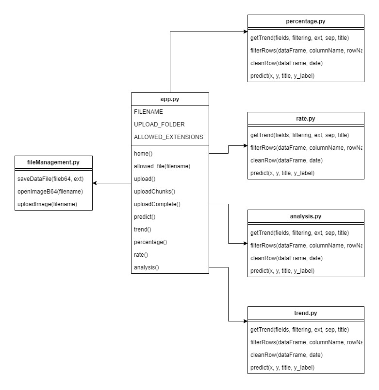
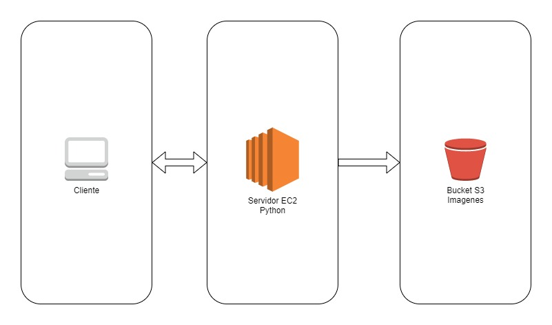

# Manual Técnico

- [Manual Técnico](#manual-técnico)
  - [Requisitos](#requisitos)
    - [Frontend](#frontend)
    - [Backend](#backend)
  - [Arbol de archivos](#arbol-de-archivos)
    - [Frontend](#frontend-1)
    - [Backend](#backend-1)
  - [Diagrama de clases](#diagrama-de-clases)
  - [Arquitectura](#arquitectura)

## Requisitos
### Frontend

- Node JS LTS
- npm
- Create-React-App
- Conocimientos sobre JS ES5 y React JS

### Backend

- Python 3
- pip 3
- gunicode
- Conocimientos sobre Python y Flask

## Arbol de archivos

### Frontend

- src
  - components: Es donde se encuentras los componentes reutilizables del proyecto
  - consts: Aquí se encuentran las constantes utilizadas
  - hooks: Es donde se encuentran los hooks utilizables para setear constantes
  - pages: Son los contenedores de los componentes antes mencionados
  - services: Se encuentra el servicio para hacer las consultas hacia el servidor REST API
### Backend

- app.py: Es el archivo principal, es donde se encuentran todos los endpoints del servidor
- requirements.txt: En este se encuentran las bibliotecas utilizadas y las que son instalables para el correcto funcionamiento del proyecto
- fileManagement.py: Es donde se encuentra el manejador de archivos tanto para escribir como para leer
## Diagrama de clases

## Arquitectura

